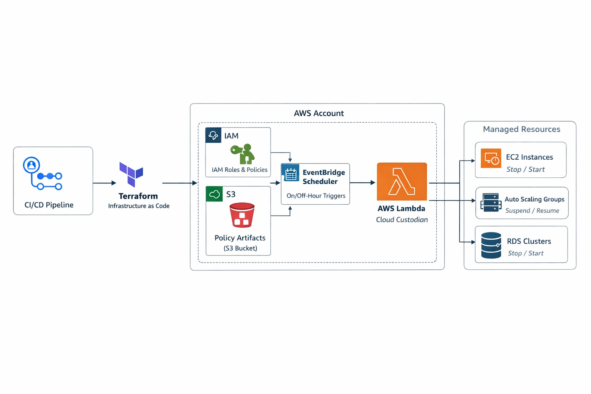

# Terraform Cloud Custodian deployment

[](https://github.com/Sanim16/terraform_custodian/actions/workflows/deploy.yml)

>This is a Terraform project that deploys a `cloudcustodian` using lambda.

## Resources:
- Terraform


# Terraform Cloud Custodian on AWS (Off-Hours Automation)

[](https://github.com/Sanim16/terraform_custodian/actions/workflows/deploy.yml)

## Overview

This repository demonstrates a **production-aligned Cloud Custodian deployment on AWS**, implemented using **Terraform** and deployed via **GitHub Actions**.

The solution enforces **automated off-hours and on-hours governance policies** that stop and restart AWS resources based on **tags and schedules**, helping reduce cloud costs while maintaining safety, auditability, and repeatability.

This project is intended as a **portfolio example** showcasing real-world cloud, platform, and DevOps engineering practices.

---

## Architecture Diagram

> **End-to-end architecture showing CI/CD, infrastructure provisioning, scheduling, and policy execution**



---

## Architecture Flow (Step-by-Step)

1. **GitHub Actions**
   - Triggers on repository changes
   - Runs Terraform `init`, `plan`, and `apply`

2. **Terraform (IaC)**
   - Provisions IAM roles (least privilege)
   - Packages and deploys Cloud Custodian as AWS Lambda
   - Creates EventBridge Schedulers
   - Uploads policy artifacts to S3

3. **Amazon EventBridge Scheduler**
   - Triggers Lambda based on on-hours / off-hours schedules

4. **AWS Lambda (Cloud Custodian)**
   - Evaluates policies
   - Filters resources using tags and schedules
   - Executes stop/start or suspend/resume actions

5. **Managed AWS Resources**
   - EC2 Instances
   - Auto Scaling Groups
   - RDS Clusters

---

## What This Project Demonstrates

- Infrastructure as Code with Terraform
- Policy-as-Code using Cloud Custodian
- Serverless automation with AWS Lambda
- Native AWS scheduling via EventBridge Scheduler
- Tag-based governance and safety controls
- CI/CD automation using GitHub Actions
- Cost optimization patterns for non-production environments

---

## Managed Resources

Cloud Custodian policies manage the following resource types:

- **EC2 instances** — stop / start
- **Auto Scaling Groups** — suspend / resume
- **RDS clusters** — stop / start

Only resources that explicitly opt-in via tagging are affected.

---

## Tag-Driven Control Model

Resources are governed using tags to ensure safe and intentional automation.

| Tag Key | Example Value | Purpose |
|------|------|------|
| `CustodianOffHours` | `Default`, `Extended hours` | Determines schedule profile |
| `Environment` | `dev`, `non-prod` | Optional environment scoping |

This approach prevents accidental outages and enables fine-grained scheduling control.

---

## Example Cloud Custodian Policy

```yaml
policies:
  - name: offhours-stop-ec2
    resource: ec2
    filters:
      - "tag:CustodianOffHours": Default
      - type: offhour
        tag: CustodianOffHours
        default_tz: gmt
        offhour: 06
        weekends: false
    actions:
      - stop

  - name: onhours-start-ec2
    resource: ec2
    filters:
      - "tag:CustodianOffHours": Default
      - type: onhour
        tag: CustodianOffHours
        default_tz: gmt
        onhour: 07
        weekends: false
    actions:
      - start

  - name: offhours-stop-asg
    resource: asg
    filters:
      - "tag:CustodianOffHours": Default
      - type: offhour
        tag: CustodianOffHours
        default_tz: gmt
        offhour: 06
    actions:
      - suspend

  - name: onhours-start-asg
    resource: asg
    filters:
      - "tag:CustodianOffHours": Default
      - type: onhour
        tag: CustodianOffHours
        default_tz: gmt
        onhour: 07
    actions:
      - resume
```

Policies are idempotent, schedule-aware, and safe to run repeatedly.


## CI/CD

Fully automated via GitHub Actions

Terraform validation and deployment handled in pipeline

No manual AWS console interaction required

Artifacts packaged outside Terraform to ensure deterministic builds

## Why This Project

This project reflects real-world cloud governance and platform engineering patterns, including:

Automated cost optimization

Safe, tag-based enforcement

Serverless scheduling

Production-aligned IaC and CI/CD workflows

It is intentionally designed to be simple to understand, safe to operate, and easy to extend.


## Cleanup
To avoid ongoing AWS costs:
```terraform
terraform destroy -auto-approve
```